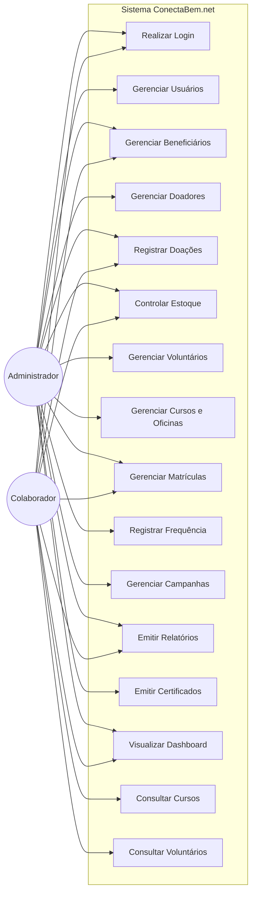
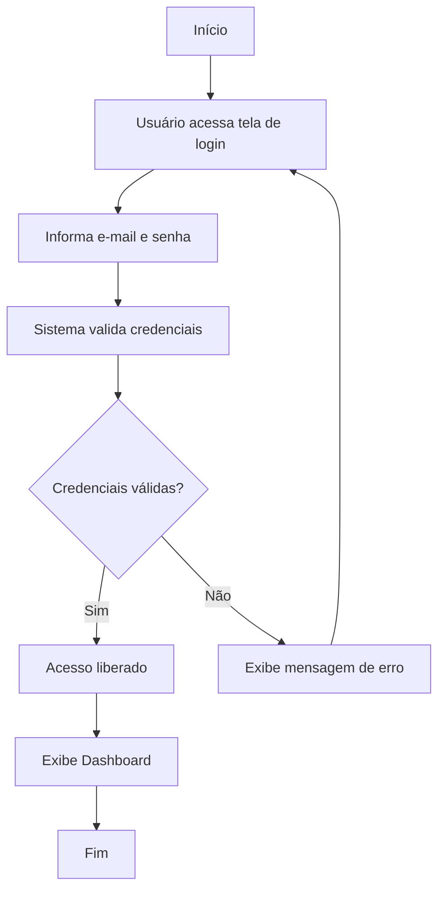
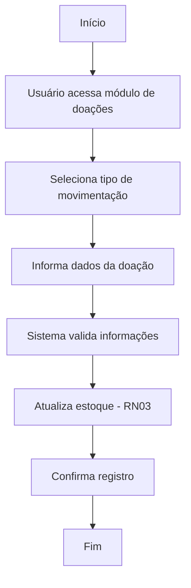
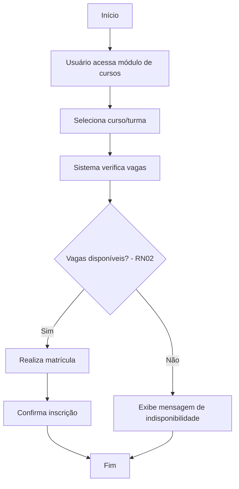
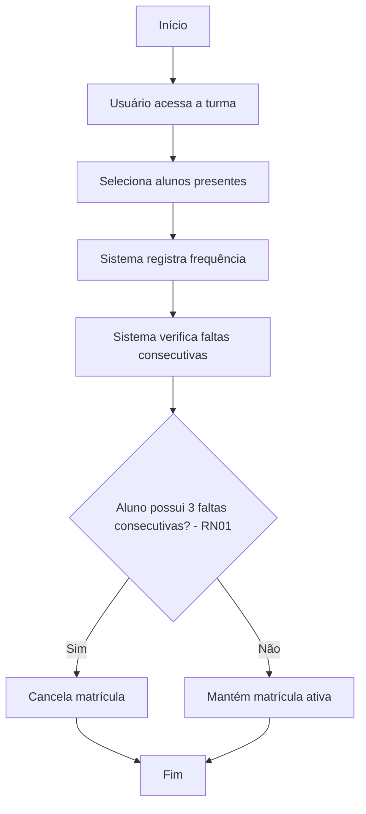
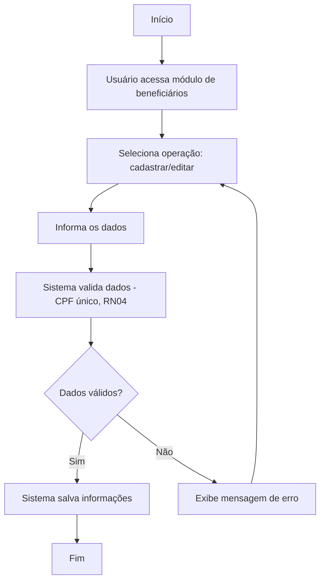
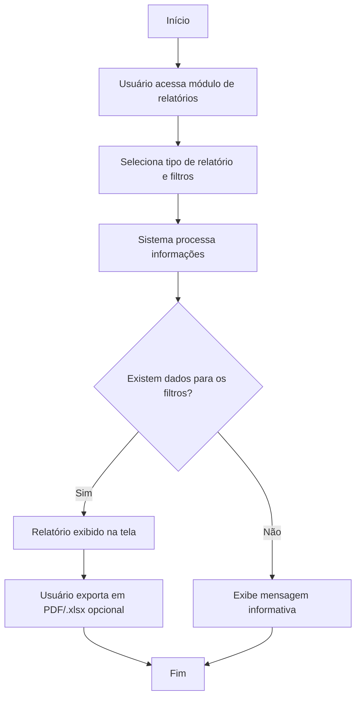
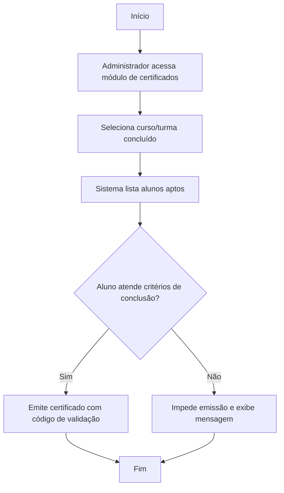
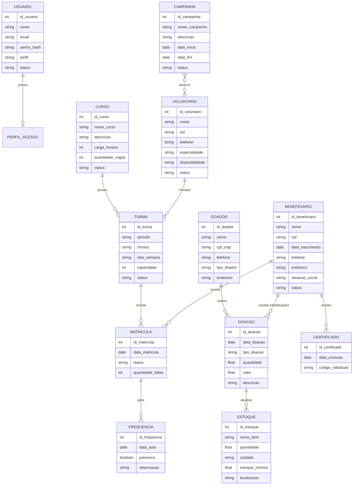

# Documentação de Referência do Sistema — ConectaBem.net

**Projeto:** Corrente do Bem — Sistema de Gestão Institucional
**Instituição:** Associação Assistencial Projeto Corrente do Bem (OSC sem fins lucrativos)
**Localização:** Rua Galdino de Souza, 261 — Vila Nova Prudente, Presidente Prudente/SP
**Base normativa:** IEEE Std 830-1998 (ERS) + LGPD (Lei n. 13.709/2018)

> Este documento consolida e reconcilia três fontes fornecidas: a ERS completa
> ("SISTEMA_CORRENTE_DO_BEM_I – alteração 1"), a tabela atualizada de Funções do
> Produto (RF_B / RF_F / RF_S) e o Mapa de Níveis de Acesso. Onde as fontes
> divergiam, isso foi sinalizado explicitamente na seção **13. Notas de
> Consistência**. O objetivo é servir como referência única e completa para o
> desenvolvimento do sistema com apoio de IA.

---

## Sumário

1. Visão Geral
2. Funções do Produto
3. Limites, Suposições e Dependências
4. Requisitos Funcionais
5. Requisitos Não Funcionais
6. Requisitos Adiados (Fora de Escopo)
7. Diagrama de Casos de Uso
8. Especificações de Casos de Uso
9. Diagramas de Atividades para Casos de Uso
10. Modelo Conceitual
11. Segurança
12. Níveis de Acesso
13. Notas de Consistência e Pontos em Aberto

---

## 1. Visão Geral

### 1.1 Objetivo

O ConectaBem.net é um sistema web de gestão institucional desenvolvido para a
Associação Assistencial Projeto Corrente do Bem, OSC que atua na promoção da
dignidade humana, no fortalecimento de vínculos e na garantia de direitos de
pessoas em situação de vulnerabilidade social, com atenção especial a pessoas
idosas. A atuação segue a Política Nacional de Assistência Social (PNAS) e é
integrada ao SUAS, por meio do Serviço de Convivência e Fortalecimento de
Vínculos (SCFV).

O sistema tem como propósito substituir os controles manuais (cadernos físicos
e planilhas não integradas) por uma solução digital simples, automatizando:

- Registro de atendimentos a beneficiários;
- Gestão de voluntários e doadores;
- Controle de doações recebidas/distribuídas e estoque;
- Gestão de cursos, oficinas, turmas, matrículas, frequência e certificados;
- Planejamento e acompanhamento de campanhas e ações sociais;
- Emissão de relatórios gerenciais e painel de indicadores (dashboard).

### 1.2 Contexto e Justificativa

Levantamento junto à gestão da entidade (ver Anexo 2 — Entrevistas) identificou:

- Cadastro de beneficiários feito em cadernos e planilhas Excel não
  integradas → duplicidade de registros e dificuldade de busca;
- Doações registradas em listas manuscritas, sem controle formal de estoque
  ou rastreabilidade de destino;
- Gestão de voluntários informal, via grupos de WhatsApp;
- Prestação de contas manual e demorada;
- Instituição com 3 colaboradores fixos e ~20 voluntários cadastrados;
- Nível técnico dos usuários básico → interface deve ser simples e intuitiva;
- Não há servidor próprio → hospedagem deverá ser em nuvem;
- Acesso deve ser possível remotamente, pois parte das ações ocorre fora da sede.

### 1.3 Benefícios Esperados

- Otimização do tempo operacional;
- Maior precisão no controle de estoque;
- Segurança dos dados e unificação da informação;
- Organização e divisão eficiente das turmas;
- Acessibilidade em diferentes dispositivos (celular, tablet, PC);
- Disponibilização de relatórios/dados institucionais consolidados.

### 1.4 Definições, Siglas e Abreviações

| Termo/Sigla | Definição |
|---|---|
| ERS | Especificação de Requisitos de Software |
| IEEE | Institute of Electrical and Electronics Engineers |
| RNF | Requisito Não Funcional |
| CRUD | Create, Read, Update, Delete |
| OSC | Organização da Sociedade Civil |
| LGPD | Lei Geral de Proteção de Dados (Lei n. 13.709/2018) |
| SCFV | Serviço de Convivência e Fortalecimento de Vínculos |
| SUAS | Sistema Único de Assistência Social |
| Beneficiário | Pessoa atendida pela instituição, que recebe auxílio/doações |
| Doador | Pessoa física ou jurídica que mantém a instituição por meio de doações |
| Voluntário | Pessoa que apoia ações e oficinas da instituição (ver nota de inconsistência §13) |
| Stakeholder | Parte interessada: cliente, usuário, gestor ou patrocinador |

### 1.5 Estudo de Viabilidade (resumo)

| Dimensão | Conclusão |
|---|---|
| Técnica | Positiva — tecnologias web maduras, baixo custo de implantação/manutenção |
| Operacional | Positiva — simplifica processos manuais, reduz retrabalho e melhora rastreabilidade |
| Econômica | Positiva — ferramentas open source; principal custo é o tempo de desenvolvimento |

**Tecnologias previstas:** HTML5, CSS3, JavaScript, PHP ou Node.js (backend),
MySQL (banco de dados), Bootstrap (responsividade), GitHub (versionamento).

**Riscos identificados:** mudança de requisitos (médio), falta de internet do
usuário (alto), falta de treinamento (médio), perda de dados (alto — mitigar
com backup diário).

### 1.6 Interfaces Externas

| Interface | Descrição |
|---|---|
| Usuários (Administrador e Colaborador) | Acessam via navegador web, desktop ou dispositivo móvel |
| Banco de dados relacional | MySQL — armazena todos os dados do sistema |
| Servidor de e-mail (SMTP) | Notificações e recuperação de senha (previsto para versões futuras) |

---

## 2. Funções do Produto

O sistema é organizado em três grandes categorias funcionais, conforme a
tabela de referência "Funções do Produto" mais recente (RF_B / RF_F / RF_S), e
detalhado por módulos de negócio na ERS. A tabela abaixo une as duas visões.

### 2.1 Categorias (RF_B / RF_F / RF_S)

- **RF_B — Funções Básicas** (autenticação e cadastros de suporte)
- **RF_F — Funções Fundamentais** (processos e transações centrais)
- **RF_S — Funções de Saída** (relatórios, alertas e notificações)

| Código | Função | Visibilidade | Categoria |
|---|---|---|---|
| RF_B01 | Autenticação (Login / Logout / Recuperação de Senha) | Visível | Obrigatório |
| RF_B02 | Gerenciar Cadastros (Usuários, Beneficiários, Doadores e Voluntários) | Visível | Obrigatório |
| RF_B03 | Gerenciar Campanhas | Visível | Obrigatório |
| RF_B04 | Gerenciar Cursos e Oficinas (Turmas) | Visível | Obrigatório |
| RF_F01 | Registrar Doação Recebida | Visível | Obrigatório |
| RF_F02 | Registrar Distribuição de Doação | Visível | Obrigatório |
| RF_F03 | Controlar Estoque de Doações | Visível | Obrigatório |
| RF_F04 | Associar Voluntário a Campanha | Visível | Obrigatório |
| RF_F05 | Registrar Resultados de Campanha | Visível | Obrigatório |
| RF_F06 | Realizar Matrícula em Curso | Visível | Obrigatório |
| RF_F07 | Registrar Frequência | Visível | Obrigatório |
| RF_S01 | Emitir Relatório de Doações | Visível | Obrigatório |
| RF_S02 | Emitir Relatório de Atendimentos | Visível | Obrigatório |
| RF_S03 | Emitir Relatório de Campanhas | Visível | Obrigatório |
| RF_S04 | Emitir Alerta de Estoque Mínimo | Oculto | Desejável |
| RF_S05 | Visualizar Painel de Controle (Dashboard) | Visível | Obrigatório |
| RF_S06 | Emitir Certificado | Visível | Obrigatório |

Todas as funções acima possuem o atributo **Tolerância a Falhas** (transação
em banco de dados), ou seja, devem ser implementadas como operações
transacionais (tudo-ou-nada), evitando estados inconsistentes em caso de falha.

### 2.2 Módulos de Negócio (visão detalhada da ERS)

| ID | Módulo | Descrição Resumida | Código(s) RF_B/F/S correspondente(s) |
|---|---|---|---|
| RF_01–04 | Autenticação e Controle de Acesso | Login seguro, logout, recuperação de senha e gerenciamento de perfis | RF_B01, RF_B02 |
| RF_05–08 | Gestão de Beneficiários | CRUD completo com histórico de atendimentos, situação socioeconômica e documentação | RF_B02 |
| RF_09–12 | Gestão de Doadores | Cadastro de doadores PF/PJ, histórico e relatório de doações | RF_B02 |
| RF_13–17 | Gestão de Doações | Registro, categorização, rastreamento e distribuição de doações | RF_F01, RF_F02, RF_F03, RF_S04 |
| RF_18–21 | Gestão de Voluntários | Cadastro, disponibilidade, habilidades e histórico de participação | RF_B02 |
| RF_22–25 | Campanhas e Ações Sociais | Planejamento, registro, acompanhamento e encerramento de campanhas | RF_B03, RF_F04, RF_F05 |
| RF_26–28 | Relatórios Gerenciais | Relatórios de doações, atendimentos e campanhas com filtros | RF_S01, RF_S02, RF_S03 |
| RF_29 | Painel de Controle (Dashboard) | Indicadores-chave: beneficiários ativos, doações do mês, próximas campanhas | RF_S05 |
| RF_30–35 * | Cursos, Oficinas e Certificação | Cadastro de cursos/turmas, matrícula, frequência e emissão de certificado | RF_B04, RF_F06, RF_F07, RF_S06 |

`* Módulo consolidado — ver §4.9 e §13.1: a ERS original cita este módulo nos
casos de uso, no modelo conceitual e nos diagramas de atividade, mas não
detalhava seus requisitos funcionais numerados; os requisitos RF_30–RF_35
foram derivados dessas seções para fechar a lacuna.`

---

## 3. Limites, Suposições e Dependências

### 3.1 Limites técnicos

- Aplicação **web responsiva**, acessível via Google Chrome, Mozilla Firefox e
  Microsoft Edge (versões atuais), adaptando-se a desktop, tablet e smartphone;
- Linguagem/framework compatíveis com hospedagem de baixo custo (VPS ou
  compartilhada);
- Banco de dados **relacional (MySQL)**;
- Toda comunicação cliente-servidor via **HTTPS** com certificado SSL válido;
- Conformidade obrigatória com a **LGPD** (Lei n. 13.709/2018);
- Entrega do MVP condicionada ao calendário acadêmico (semestre letivo de 2026);
- **Sem** integrações com APIs bancárias, gateways de pagamento ou sistemas
  fiscais externos nesta versão.

### 3.2 Perfis de usuário

| Perfil | Nível Técnico | Frequência de Uso | Responsabilidades Principais |
|---|---|---|---|
| Administrador | Intermediário | Diária | Gerenciar usuários, acessar todos os módulos, emitir relatórios, configurar o sistema e auditar registros |
| Colaborador | Básico a Intermediário | Diária/Semanal | Cadastrar beneficiários, doadores e voluntários; registrar atendimentos e doações; acompanhar campanhas |

### 3.3 Suposições

- A instituição disponibilizará um responsável (ponto focal) para validar
  requisitos e participar de testes;
- Colaboradores terão acesso a computador com navegador atualizado e conexão
  à internet;
- A instituição providenciará/autorizará a contratação de hospedagem web
  adequada para produção;
- Usuários possuem experiência básica a intermediária com computadores e
  navegadores — a interface deve minimizar a necessidade de treinamento.

### 3.4 Dependências

- Servidor web com suporte a **PHP 8+ (ou Node.js)**;
- Banco de dados **MySQL**;
- Qualquer alteração significativa de escopo após aprovação desta
  documentação deve ser formalizada e validada por ambas as partes.

---

## 4. Requisitos Funcionais

### 4.1 Módulo 1 — Autenticação e Controle de Acesso

| ID | Descrição | Prioridade |
|---|---|---|
| RF_01 | O sistema deve permitir que usuários realizem login com e-mail e senha. | Alta |
| RF_02 | O sistema deve permitir logout seguro do usuário autenticado. | Alta |
| RF_03 | O sistema deve permitir recuperação de senha por e-mail. | Média |
| RF_04 | O sistema deve permitir cadastro, edição, desativação e exclusão de usuários colaboradores pelo administrador. | Alta |

### 4.2 Módulo 2 — Gestão de Beneficiários

| ID | Descrição | Prioridade |
|---|---|---|
| RF_05 | O sistema deve permitir cadastrar beneficiários com dados pessoais e socioeconômicos. | Alta |
| RF_06 | O sistema deve permitir editar dados de beneficiários cadastrados. | Alta |
| RF_07 | O sistema deve registrar o histórico de atendimentos de cada beneficiário. | Alta |
| RF_08 | O sistema deve permitir consultar beneficiários por nome, CPF ou status. | Média |

### 4.3 Módulo 3 — Gestão de Doadores

| ID | Descrição | Prioridade |
|---|---|---|
| RF_09 | O sistema deve permitir o cadastro de doadores pessoa física (nome, CPF, contato) e pessoa jurídica (razão social, CNPJ, contato). | Alta |
| RF_10 | O sistema deve registrar o histórico de doações por doador. | Alta |
| RF_11 | O sistema deve permitir a edição e exclusão lógica de doadores. | Média |
| RF_12 | O sistema deve permitir pesquisar doadores por nome, CPF/CNPJ ou tipo. | Média |

### 4.4 Módulo 4 — Gestão de Doações

| ID | Descrição | Prioridade |
|---|---|---|
| RF_13 | O sistema deve registrar doações recebidas com tipo (alimentos, roupas, móveis e utensílios, outros), quantidade, data e doador. | Alta |
| RF_14 | O sistema deve controlar o estoque de doações disponíveis para distribuição. | Alta |
| RF_15 | O sistema deve registrar a distribuição de doações para beneficiários. | Alta |
| RF_16 | O sistema deve emitir alertas quando o estoque de determinado tipo de doação atingir nível mínimo. | Baixa |
| RF_17 | O sistema deve permitir filtragem de doações por tipo, período e status. | Média |

### 4.5 Módulo 5 — Gestão de Voluntários

| ID | Descrição | Prioridade |
|---|---|---|
| RF_18 | O sistema deve permitir o cadastro de voluntários com dados pessoais, habilidades e disponibilidade de horários. | Alta |
| RF_19 | O sistema deve registrar a participação dos voluntários em campanhas e ações. | Alta |
| RF_20 | O sistema deve permitir a edição e exclusão lógica de voluntários. | Média |
| RF_21 | O sistema deve permitir busca de voluntários por nome, habilidade ou disponibilidade. | Média |

### 4.6 Módulo 6 — Campanhas e Ações Sociais

| ID | Descrição | Prioridade |
|---|---|---|
| RF_22 | O sistema deve permitir o cadastro de campanhas com título, descrição, data de início, data de término e status. | Alta |
| RF_23 | O sistema deve associar voluntários a campanhas cadastradas. | Média |
| RF_24 | O sistema deve registrar os resultados das campanhas (beneficiários atendidos, doações distribuídas). | Alta |
| RF_25 | O sistema deve permitir filtragem de campanhas por status (ativa, encerrada, planejada) e período. | Média |

### 4.7 Módulo 7 — Relatórios e Dashboard

| ID | Descrição | Prioridade |
|---|---|---|
| RF_26 | O sistema deve gerar relatório de doações recebidas e distribuídas por período. | Alta |
| RF_27 | O sistema deve gerar relatório de atendimentos realizados por período. | Alta |
| RF_28 | O sistema deve gerar relatório de campanhas com resultados consolidados. | Média |
| RF_29 | O sistema deve exibir um painel de controle com indicadores: total de beneficiários ativos, doações do mês, próximas campanhas e total de voluntários. | Alta |

### 4.8 Requisito transversal de exportação

| ID | Descrição | Prioridade |
|---|---|---|
| RF_29a | O sistema deve permitir exportar os relatórios gerados em PDF e planilha (.xlsx). | Média |

### 4.9 Módulo 8 — Cursos, Oficinas e Certificação *(consolidado — ver §13.1)*

| ID | Descrição | Prioridade | Ref. RF_B/F/S |
|---|---|---|---|
| RF_30 | O sistema deve permitir cadastrar, editar e consultar cursos/oficinas (nome, descrição, carga horária, quantidade de vagas, status). | Alta | RF_B04 |
| RF_31 | O sistema deve permitir cadastrar turmas vinculadas a um curso, com período, horário, dias da semana, capacidade e status. | Alta | RF_B04 |
| RF_32 | O sistema deve permitir realizar a matrícula de um beneficiário em uma turma, verificando a disponibilidade de vagas (RN02) antes de confirmar. | Alta | RF_F06 |
| RF_33 | O sistema deve permitir registrar a frequência (presença/falta) dos alunos matriculados em cada aula da turma. | Alta | RF_F07 |
| RF_34 | O sistema deve cancelar automaticamente a matrícula de um aluno após 3 faltas consecutivas (RN01) e notificar o responsável pela turma. | Média | RF_F07 |
| RF_35 | O sistema deve emitir certificado de conclusão (com código de validação) para alunos concluintes de um curso/oficina. | Alta | RF_S06 |
| RF_36 | O sistema deve permitir que Colaboradores consultem (sem gerenciar) cursos, turmas e voluntários. | Média | — |

*Tabela consolidada de requisitos funcionais.*

---

## 5. Requisitos Não Funcionais

| ID | Categoria | Descrição | Prioridade |
|---|---|---|---|
| RNF_01 | Desempenho | O sistema deve responder a qualquer requisição do usuário em no máximo 3 segundos em condições normais de uso. | Alta |
| RNF_02 | Segurança | As senhas dos usuários devem ser armazenadas com algoritmo de hash seguro (bcrypt/scrypt ou Argon2). | Alta |
| RNF_03 | Segurança | Toda comunicação deve ser realizada via HTTPS com certificado SSL válido. | Alta |
| RNF_04 | Conformidade | O sistema deve estar em conformidade com a LGPD, garantindo privacidade e proteção dos dados pessoais. | Alta |
| RNF_05 | Usabilidade | A interface deve ser intuitiva e responsiva, adaptando-se a diferentes tamanhos de tela (mobile, tablet e desktop). | Alta |
| RNF_06 | Disponibilidade | O sistema deve estar disponível 99% do tempo em dias úteis, com janela de manutenção nos finais de semana. | Média |
| RNF_07 | Manutenibilidade | O código deve ser documentado e seguir padrões de desenvolvimento para facilitar manutenção e evolução. | Média |
| RNF_08 | Compatibilidade | O sistema deve funcionar nos navegadores Google Chrome, Firefox e Edge (versões atuais). | Alta |
| RNF_09 | Escalabilidade | A arquitetura deve permitir a adição de novos módulos sem necessidade de refatoração completa. | Baixa |
| RNF_10 | Portabilidade | O sistema deve poder ser implantado em diferentes ambientes de hospedagem (Linux/Windows Server). | Baixa |

---

## 6. Requisitos Adiados (Fora de Escopo desta Versão)

- Integração com APIs bancárias ou sistemas de pagamento;
- Geração de documentos fiscais (notas fiscais, recibos com validade legal);
- Aplicativos móveis nativos (iOS/Android);
- Módulo de gestão financeira contábil;
- Envio automático de e-mails/notificações via SMTP (previsto apenas como
  dependência futura para recuperação de senha).

---

## 7. Diagrama de Casos de Uso

### 7.1 Atores

- **Administrador** — acesso total ao sistema.
- **Colaborador** — acesso operacional ao dia a dia do atendimento.

> Ver §13.2 quanto à menção a um terceiro perfil "Voluntário" em fontes
> secundárias, não tratado como ator do sistema na ERS principal.

### 7.2 Casos de uso por ator

**Administrador:** Realizar Login; Gerenciar Usuários; Gerenciar
Beneficiários; Gerenciar Doadores; Registrar Doações; Controlar Estoque;
Gerenciar Voluntários; Gerenciar Cursos e Oficinas; Gerenciar Matrículas;
Registrar Frequência; Gerenciar Campanhas; Emitir Relatórios; Emitir
Certificados; Visualizar Dashboard.

**Colaborador:** Realizar Login; Gerenciar Beneficiários; Registrar Doações;
Controlar Estoque; Gerenciar Matrículas; Consultar Cursos; Consultar
Voluntários; Emitir Relatórios; Visualizar Dashboard.

### 7.3 Diagrama (Mermaid)

---

## 8. Especificações de Casos de Uso

### UC01 — Realizar Login

| Item | Descrição |
|---|---|
| Referências | RF_01, RF_02, RF_03 |
| Descrição Geral | Autenticar o usuário no sistema por e-mail e senha. |
| Atores | Administrador, Colaborador |
| Pré-condições | Usuário previamente cadastrado e ativo. |
| Pós-condições | Usuário autenticado com sessão iniciada; acesso liberado conforme perfil. |
| Fluxo Básico | 1. Usuário acessa a tela de login. 2. Informa e-mail e senha. 3. Sistema valida credenciais. 4. Sistema redireciona para o Dashboard. |
| Fluxo Alternativo | Credenciais inválidas → sistema exibe mensagem de erro e permanece na tela de login. "Esqueci minha senha" → aciona fluxo de recuperação de senha por e-mail (RF_03). |

### UC02 — Gerenciar Usuários

| Item | Descrição |
|---|---|
| Referências | RF_04 |
| Descrição Geral | Cadastrar, editar, desativar e excluir usuários colaboradores. |
| Atores | Administrador |
| Pré-condições | Administrador autenticado. |
| Pós-condições | Usuário criado, atualizado, desativado ou excluído. |
| Fluxo Básico | 1. Administrador acessa módulo de usuários. 2. Seleciona operação (criar/editar/desativar/excluir). 3. Informa/edita dados. 4. Sistema valida e persiste a alteração. |
| Fluxo Alternativo | Dados inválidos ou e-mail já cadastrado → sistema exibe mensagem de erro. |

### UC03 — Gerenciar Beneficiários

| Item | Descrição |
|---|---|
| Referências | RF_05, RF_06, RF_07, RF_08 |
| Descrição Geral | Cadastrar, editar, consultar e acompanhar beneficiários. |
| Atores | Administrador, Colaborador |
| Pré-condições | Usuário autenticado no sistema. |
| Pós-condições | Beneficiário cadastrado ou atualizado corretamente. |
| Fluxo Básico | 1. Usuário acessa módulo de beneficiários. 2. Seleciona operação desejada. 3. Informa os dados. 4. Sistema valida os dados (RN04 — impede CPF duplicado). 5. Sistema salva as informações e, quando aplicável, registra no histórico de atendimentos. |
| Fluxo Alternativo | Dados inválidos ou CPF duplicado → sistema exibe mensagem de erro. |

### UC04 — Gerenciar Doadores

| Item | Descrição |
|---|---|
| Referências | RF_09, RF_10, RF_11, RF_12 |
| Descrição Geral | Cadastrar, editar (exclusão lógica) e consultar doadores PF/PJ, com histórico de doações. |
| Atores | Administrador, Colaborador |
| Pré-condições | Usuário autenticado. |
| Pós-condições | Doador cadastrado/atualizado; histórico de doações disponível para consulta. |
| Fluxo Básico | 1. Usuário acessa módulo de doadores. 2. Seleciona operação (cadastrar/editar/pesquisar). 3. Informa dados (PF: nome/CPF/contato; PJ: razão social/CNPJ/contato). 4. Sistema valida e salva. |
| Fluxo Alternativo | Documento inválido/duplicado → sistema exibe mensagem de erro. |

### UC05 — Registrar Doações

| Item | Descrição |
|---|---|
| Referências | RF_13, RF_14, RF_15 |
| Descrição Geral | Registrar entrada e distribuição de doações. |
| Atores | Administrador, Colaborador |
| Pré-condições | Doador e beneficiário cadastrados no sistema (quando aplicável). |
| Pós-condições | Doação registrada e estoque atualizado (RN03). |
| Fluxo Básico | 1. Usuário acessa módulo de doações. 2. Seleciona o tipo de movimentação (entrada/distribuição). 3. Informa tipo, quantidade/valor e destinatário. 4. Sistema registra a movimentação. 5. Estoque é atualizado automaticamente. |
| Fluxo Alternativo | Estoque insuficiente para distribuição → sistema informa indisponibilidade. |

### UC06 — Controlar Estoque

| Item | Descrição |
|---|---|
| Referências | RF_14, RF_16, RF_17 |
| Descrição Geral | Consultar níveis de estoque de doações e receber alertas de estoque mínimo. |
| Atores | Administrador, Colaborador |
| Pré-condições | Existência de itens cadastrados no estoque. |
| Pós-condições | Estoque consultado/filtrado; alerta exibido quando aplicável. |
| Fluxo Básico | 1. Usuário acessa módulo de estoque. 2. Aplica filtros (tipo, período, status). 3. Sistema exibe quantidades disponíveis. 4. Sistema sinaliza itens abaixo do estoque mínimo (RF_S04). |
| Fluxo Alternativo | Nenhum item encontrado com os filtros aplicados → sistema exibe mensagem informativa. |

### UC07 — Gerenciar Voluntários

| Item | Descrição |
|---|---|
| Referências | RF_18, RF_19, RF_20, RF_21 |
| Descrição Geral | Cadastrar, editar (exclusão lógica), consultar e acompanhar a participação de voluntários. |
| Atores | Administrador (gerencia); Colaborador (consulta — RF_36) |
| Pré-condições | Usuário autenticado. |
| Pós-condições | Voluntário cadastrado/atualizado; participação registrada. |
| Fluxo Básico | 1. Usuário acessa módulo de voluntários. 2. Seleciona operação (cadastrar/editar/buscar). 3. Informa dados pessoais, habilidades e disponibilidade. 4. Sistema valida e salva. |
| Fluxo Alternativo | CPF duplicado ou dados inválidos → sistema exibe mensagem de erro. |

### UC08 — Gerenciar Cursos e Oficinas

| Item | Descrição |
|---|---|
| Referências | RF_30, RF_31 |
| Descrição Geral | Cadastrar cursos/oficinas e suas turmas (dias, horários, vagas). |
| Atores | Administrador (gerencia); Colaborador (consulta — RF_36) |
| Pré-condições | Usuário autenticado. |
| Pós-condições | Curso e/ou turma cadastrados ou atualizados. |
| Fluxo Básico | 1. Administrador acessa módulo de cursos. 2. Cadastra curso (nome, descrição, carga horária, vagas). 3. Cadastra turma vinculada (período, horário, dias, capacidade). 4. Sistema salva as informações. |
| Fluxo Alternativo | Dados obrigatórios ausentes → sistema exibe mensagem de erro. |

### UC09 — Gerenciar Matrículas (Realizar Matrícula em Curso)

| Item | Descrição |
|---|---|
| Referências | RF_32 |
| Descrição Geral | Matricular um beneficiário em uma turma de curso/oficina. |
| Atores | Administrador, Colaborador |
| Pré-condições | Beneficiário e turma cadastrados. |
| Pós-condições | Matrícula registrada e vinculada ao beneficiário e à turma. |
| Fluxo Básico | 1. Usuário acessa módulo de cursos. 2. Seleciona curso/turma. 3. Sistema verifica vagas disponíveis (RN02). 4. Se houver vaga, realiza a matrícula e confirma a inscrição. |
| Fluxo Alternativo | Sem vagas disponíveis → sistema exibe mensagem de indisponibilidade e não efetiva a matrícula. |

### UC10 — Registrar Frequência

| Item | Descrição |
|---|---|
| Referências | RF_33, RF_34 |
| Descrição Geral | Registrar presença/falta dos alunos matriculados em uma turma. |
| Atores | Administrador |
| Pré-condições | Existência de matrícula ativa do aluno na turma. |
| Pós-condições | Frequência registrada; matrícula cancelada automaticamente se aplicável (RN01). |
| Fluxo Básico | 1. Usuário acessa a turma. 2. Seleciona os alunos presentes. 3. Sistema registra a frequência. 4. Sistema verifica faltas consecutivas. 5. Se o aluno atingir 3 faltas consecutivas, a matrícula é cancelada automaticamente; caso contrário, permanece ativa. |
| Fluxo Alternativo | Nenhuma ação — fluxo é determinístico conforme a regra RN01. |

### UC11 — Gerenciar Campanhas

| Item | Descrição |
|---|---|
| Referências | RF_22, RF_23, RF_24, RF_25 |
| Descrição Geral | Planejar, registrar, acompanhar e encerrar campanhas e ações sociais. |
| Atores | Administrador |
| Pré-condições | Usuário autenticado. |
| Pós-condições | Campanha cadastrada/atualizada; voluntários associados; resultados registrados. |
| Fluxo Básico | 1. Administrador acessa módulo de campanhas. 2. Cadastra campanha (título, descrição, datas, status). 3. Associa voluntários. 4. Ao encerrar, registra resultados (beneficiários atendidos, doações distribuídas). |
| Fluxo Alternativo | Datas inconsistentes (fim antes do início) → sistema exibe mensagem de erro. |

### UC12 — Emitir Relatórios

| Item | Descrição |
|---|---|
| Referências | RF_26, RF_27, RF_28, RF_29a |
| Descrição Geral | Gerar relatórios gerenciais do sistema (doações, atendimentos, campanhas, voluntários). |
| Atores | Administrador (todos os relatórios); Colaborador (relatórios básicos) |
| Pré-condições | Existirem dados cadastrados no sistema. |
| Pós-condições | Relatório gerado e exibido em tela, com opção de exportação em PDF/.xlsx. |
| Fluxo Básico | 1. Usuário acessa módulo de relatórios. 2. Seleciona o tipo de relatório e filtros (período, tipo, status). 3. Sistema processa as informações. 4. Relatório é exibido na tela, com opção de exportar. |
| Fluxo Alternativo | Nenhum dado encontrado para os filtros → sistema exibe mensagem informativa. |

### UC13 — Emitir Certificados

| Item | Descrição |
|---|---|
| Referências | RF_35 |
| Descrição Geral | Emitir certificado de conclusão para aluno concluinte de curso/oficina. |
| Atores | Administrador |
| Pré-condições | Aluno com matrícula concluída (frequência mínima atendida). |
| Pós-condições | Certificado emitido, com código de validação gerado. |
| Fluxo Básico | 1. Administrador acessa módulo de certificados. 2. Seleciona a turma/curso concluído. 3. Sistema lista alunos aptos. 4. Administrador emite o(s) certificado(s). 5. Sistema gera código de validação e disponibiliza para download/impressão. |
| Fluxo Alternativo | Aluno não atende aos critérios de conclusão → sistema impede a emissão e exibe mensagem. |

### UC14 — Visualizar Dashboard

| Item | Descrição |
|---|---|
| Referências | RF_29 |
| Descrição Geral | Exibir painel de indicadores-chave do sistema. |
| Atores | Administrador, Colaborador |
| Pré-condições | Usuário autenticado. |
| Pós-condições | Indicadores exibidos: beneficiários ativos, doações do mês, voluntários ativos, próximas campanhas. |
| Fluxo Básico | 1. Usuário realiza login. 2. Sistema calcula e exibe os indicadores atualizados na tela inicial. |
| Fluxo Alternativo | Nenhum dado ainda cadastrado → sistema exibe indicadores zerados com mensagem orientativa. |

---

## 9. Diagramas de Atividades para Casos de Uso

### 9.1 Realizar Login

### 9.2 Registrar Doações

### 9.3 Realizar Matrícula em Curso

### 9.4 Registrar Frequência

### 9.5 Gerenciar Beneficiários (cadastro/edição)

### 9.6 Emitir Relatórios

### 9.7 Emitir Certificado

---

## 10. Modelo Conceitual

O modelo conceitual reúne as entidades identificadas nos requisitos
funcionais e casos de uso, garantindo coerência entre requisitos, regras de
negócio, casos de uso e estrutura de dados.

### 10.1 Entidades e Atributos Principais

| Entidade | Atributos principais |
|---|---|
| Usuário | id_usuario, nome, e-mail, senha (hash), perfil, status |
| Beneficiário | id_beneficiario, nome, CPF, data_nascimento, telefone, endereço, situação_social, status |
| Voluntário | id_voluntario, nome, CPF, telefone, especialidade, disponibilidade, status |
| Doador | id_doador, nome, CPF_CNPJ, telefone, tipo_doador, endereço |
| Doação | id_doacao, data_doacao, tipo_doacao, quantidade, valor, descrição |
| Estoque | id_estoque, nome_item, quantidade, unidade, estoque_minimo, localização |
| Curso | id_curso, nome_curso, descrição, carga_horaria, quantidade_vagas, status |
| Turma | id_turma, período, horário, dias_semana, capacidade, status |
| Matrícula | id_matricula, data_matricula, status, quantidade_faltas |
| Frequência | id_frequencia, data_aula, presença, observação |
| Campanha | id_campanha, nome_campanha, descrição, data_inicio, data_fim, status |
| Certificado | id_certificado, data_emissao, código_validação |

### 10.2 Relacionamentos e Cardinalidades

| Relacionamento | Cardinalidade |
|---|---|
| Um usuário possui um perfil de acesso | 1:1 |
| Um doador pode realizar várias doações | 1:N |
| Uma doação pode atualizar vários itens do estoque | 1:N |
| Um curso pode possuir várias turmas | 1:N |
| Uma turma pertence a um curso | N:1 |
| Um voluntário pode ministrar várias turmas | 1:N |
| Uma turma pode possuir vários alunos matriculados | 1:N |
| Um beneficiário pode possuir várias matrículas | 1:N |
| Uma matrícula pertence a um beneficiário | N:1 |
| Uma matrícula pode possuir várias frequências | 1:N |
| Uma campanha pode possuir vários voluntários | N:N |
| Um beneficiário pode receber vários certificados | 1:N |

### 10.3 Diagrama Entidade-Relacionamento (Mermaid)

### 10.4 Regras de Negócio

| ID | Regra de Negócio |
|---|---|
| RN01 | O sistema deve cancelar automaticamente a matrícula após 3 faltas consecutivas. |
| RN02 | O sistema não deve permitir matrícula sem vagas disponíveis. |
| RN03 | O sistema deve atualizar automaticamente o estoque após movimentações de doação. |
| RN04 | O sistema deve impedir cadastro duplicado de CPF. |
| RN05 | O sistema deve permitir apenas usuários autenticados acessarem o sistema. |

---

## 11. Segurança

### 11.1 Requisitos legais e normativos

- Conformidade com a **LGPD** (Lei n. 13.709/2018) no tratamento de dados
  pessoais de beneficiários, doadores, voluntários e usuários;
- Uso obrigatório de conexão **HTTPS** (certificado SSL válido);
- **Controle de acesso por perfil de usuário** (Administrador / Colaborador).

### 11.2 Controles técnicos obrigatórios

- Senhas armazenadas com **hash seguro** (bcrypt/scrypt ou Argon2) — nunca em
  texto plano (RNF_02);
- Toda comunicação cliente-servidor criptografada via HTTPS (RNF_03);
- **Controle de sessão** do usuário autenticado (expiração, logout seguro);
- **Autenticação obrigatória** para qualquer operação no sistema (RN05);
- Exclusões de doadores e voluntários devem ser **lógicas** (soft delete),
  preservando histórico e rastreabilidade (RF_11, RF_20);
- Recomenda-se **backup diário** do banco de dados, com armazenamento em
  nuvem, e controle de versões da aplicação;
- Atualizações do sistema devem ocorrer fora do horário de funcionamento,
  precedidas de backup e testes.

### 11.3 Segurança e privacidade de dados sensíveis

- Dados de beneficiários (situação socioeconômica, composição familiar) e de
  doadores/voluntários (CPF/CNPJ) devem ser tratados como dados pessoais
  sensíveis conforme a LGPD, com acesso restrito por perfil;
- Recomenda-se auditoria/log de acesso às operações que envolvam dados
  pessoais, especialmente para o perfil Administrador.

---

## 12. Níveis de Acesso

### 12.1 Descrição dos Perfis

**Administrador** — possui acesso total ao sistema. Além de executar todas as
operações do Colaborador, é responsável por: gerenciar contas de usuário
(criar, editar, desativar e excluir colaboradores); gerenciar doadores e
voluntários; gerenciar campanhas; gerenciar o módulo de cursos e oficinas
(incluindo turmas); registrar frequência dos alunos; emitir certificados; e
acessar/auditar todos os relatórios e configurações do sistema.

**Colaborador** — possui acesso operacional, voltado ao dia a dia do
atendimento: realiza login; cadastra e consulta beneficiários; registra
doações recebidas e sua distribuição; controla o estoque de doações; realiza
matrículas em cursos; consulta (sem gerenciar) cursos e voluntários; e emite
relatórios básicos. **Não** tem acesso à gestão de usuários, configurações do
sistema ou emissão de certificados (ver nota de inconsistência §13.3).

### 12.2 Matriz de Permissões (Nível de Acesso × Função)

| Função | Administrador | Colaborador |
|---|---|---|
| RF_B01 — Autenticação | X | X |
| RF_B02 — Gerenciar Beneficiários | X | X |
| RF_B02 — Gerenciar Doadores | X | Consulta/registro básico |
| RF_B02 — Gerenciar Colaboradores (usuários) | X | — |
| RF_B02 — Gerenciar Voluntários | X | Somente consulta |
| RF_B03 — Gerenciar Campanhas | X | Somente consulta/participação |
| RF_B04 — Gerenciar Cursos e Oficinas | X | Somente consulta |
| RF_F01 — Registrar Doação Recebida | X | X |
| RF_F02 — Registrar Distribuição de Doação | X | X |
| RF_F03 — Controlar Estoque de Doações | X | X |
| RF_F04 — Associar Voluntário a Campanha | X | — |
| RF_F05 — Registrar Resultados de Campanha | X | — |
| RF_F06 — Realizar Matrícula em Curso | X | X |
| RF_F07 — Registrar Frequência | X | — |
| RF_S01 — Emitir Relatório de Doações | X | — |
| RF_S02 — Emitir Relatório de Atendimentos | X | X (básico) |
| RF_S03 — Emitir Relatório de Campanhas | X | — |
| RF_S04 — Emitir Alerta de Estoque Mínimo | X | X |
| RF_S05 — Visualizar Painel de Controle | X | X |
| RF_S06 — Emitir Certificado | X | — |

> Esta matriz reflete a descrição textual dos perfis (fonte mais detalhada e
> consistente com a ERS). O documento fonte "Mapa de Níveis de Acesso"
> apresenta uma matriz tabular com pequenas divergências pontuais em relação
> a este texto — ver §13.3 para os detalhes e recomendação de validação com
> o stakeholder antes da implementação.

---

## 13. Notas de Consistência e Pontos em Aberto

Estas notas existem para que a equipe (e a IA que apoiará o desenvolvimento)
tratem corretamente pontos onde os documentos-fonte não eram idênticos ou
estavam incompletos. Recomenda-se validar cada item com o stakeholder antes
de travar a implementação.

1. **Módulo de Cursos e Oficinas ausente na lista numerada de Requisitos
   Funcionais da ERS.** A ERS principal (seção 2.4) detalha os Módulos 1 a 7
   (RF_01–RF_29), mas não apresenta um "Módulo — Cursos e Oficinas" com
   requisitos numerados, embora o Diagrama de Casos de Uso, o Modelo
   Conceitual (entidades Curso, Turma, Matrícula, Frequência, Certificado) e
   os Diagramas de Atividade ("Matrícula em Curso" e "Registrar Frequência")
   tratem esse módulo como parte do sistema. A tabela mais recente de
   "Funções do Produto" (RF_B04, RF_F06, RF_F07, RF_S06) confirma que esse
   módulo é obrigatório. Os requisitos **RF_30 a RF_36** (seção 4.9) foram
   **derivados/consolidados** a partir dessas seções para preencher essa
   lacuna e não devem ser tratados como texto literal de nenhum documento
   original — recomenda-se revisão do stakeholder.

2. **Ator "Voluntário" tratado de forma inconsistente entre fontes.**
   - A tabela de Definições da ERS descreve "Voluntário" como *"Usuário com
     perfil de administrador do sistema"*, o que contradiz o restante do
     documento (onde Voluntário é uma entidade de apoio às oficinas/campanhas,
     não um ator do sistema com login).
   - O Apêndice 3 (Configuração Inicial) lista três perfis de permissão:
     Administrador (controle total), Colaborador (operações administrativas)
     e **Voluntário** (controle de frequência) — sugerindo que o voluntário
     poderia, em versões futuras, ter login próprio para registrar
     frequência.
   - Neste documento, tratamos **Voluntário como uma entidade de dados**, não
     como ator autenticado do sistema, por ser a interpretação predominante e
     mais consistente com o Diagrama de Casos de Uso (que lista apenas
     Administrador e Colaborador como atores). Essa definição deve ser
     confirmada com o stakeholder.

3. **Divergência na matriz de permissões do certificado (RF_S06).** O
   documento "Mapa de Níveis de Acesso" traz uma tabela em que a coluna do
   Colaborador (rotulada apenas como "Nível x", nome não finalizado no
   original) marca "X" para RF_S06 — Emitir Certificado — enquanto o texto
   descritivo do mesmo documento afirma explicitamente que o Colaborador
   **não** tem acesso à emissão de certificados. Neste documento, prevalece o
   texto descritivo (Colaborador sem acesso a certificados), por ser mais
   detalhado; a divergência deve ser confirmada antes da implementação do
   controle de acesso.

4. **Coluna de perfil sem nome definido.** No "Mapa de Níveis de Acesso", a
   segunda coluna da matriz de permissões está rotulada apenas como **"Nível
   x"**, não "Colaborador". Assumimos, por contexto, que se refere ao perfil
   Colaborador — mas o nome não estava explicitamente definido no
   documento-fonte.

5. **Linha ausente na matriz de permissões original.** A matriz do "Mapa de
   Níveis de Acesso" não traz uma linha para **RF_S03 — Emitir Relatório de
   Campanhas**; ela foi incluída nesta consolidação por analogia às demais
   funções de relatório (RF_S01, RF_S02), atribuída somente ao Administrador.
   Recomenda-se confirmação.

6. **Numeração dupla dos requisitos funcionais.** O sistema utiliza duas
   convenções de identificação em paralelo: `RF_01`–`RF_29` (por módulo de
   negócio, usada na ERS) e `RF_B/F/S` (por categoria funcional, usada na
   tabela de Funções do Produto e no Mapa de Níveis de Acesso). Este
   documento mantém as duas nomenclaturas e faz o mapeamento entre elas nas
   seções 2 e 4 para evitar ambiguidade durante o desenvolvimento.

7. **Autores e RAs incompletos no documento fonte.** A ERS lista os autores
   Maria Eduarda Souza Fernandes, Luiz, Felipe Ferreira dos Santos e Lucas,
   com RA ausente para "Luiz" e "Lucas" no documento original — informação
   apenas de referência acadêmica, sem impacto técnico.

